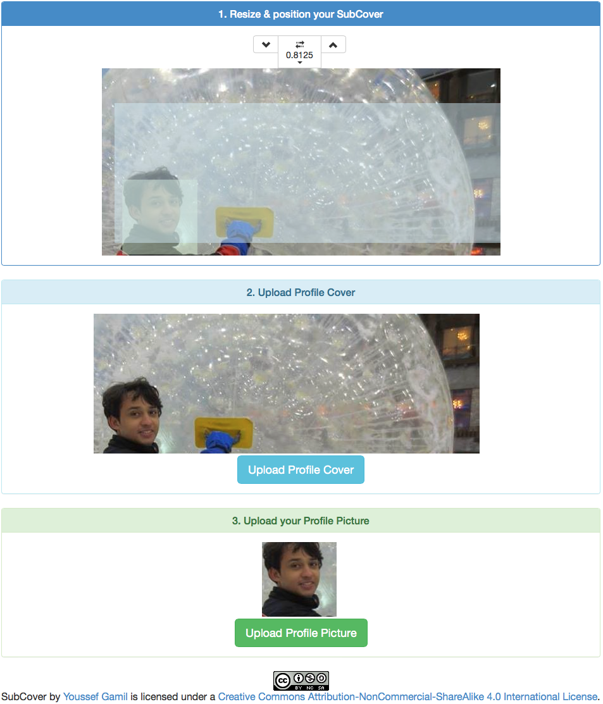

# apps.facebook.com/ [SubCover](http://apps.facebook.com/subcover)

I was trying to upload Javascript generated/manipulated images to facebook and 1 day I was starting at someone’s profile picture photo which was a sub-image from the profile cover picture; later on, I tried writing some Javascript to do the same & that’s it
+	1st commit @ [Nov 29, 2013](https://github.com/yoga1290/HTML5/commit/a0ce4284a3a16c4507cc95cce13ebcfd159cc26e)
+	Mouse Click for popup,
Some browsers block popups if they weren’t triggered by some event; mouse click or smth
+	“Cross-origin resource sharing”,
Usually browsers will prevent Javascript (your script; your server) to load your profile cover, manipulate it and send it back to facebook; that’s why I’m passing images to my domain first then to the HTML5 page to be manipulated then to facebook via AJAX

## Server-side/ [AppEngine](Servlet/subcover.java)

Actually, the server-side doesn’t do much expect requesting the facebook access token via OAuth 2.0 and delivering the cover photo to the Facebook app just to get over the “Cross-origin resource sharing” nightmare!

## UI:

1st you specify the size of the profile picture & cover frames by clicking the up & down buttons; it’s like doing a binary search by excluding a half-interval on each press

… was my 1st time to try Twitter’s Bootstrap themes & I’m loving it!